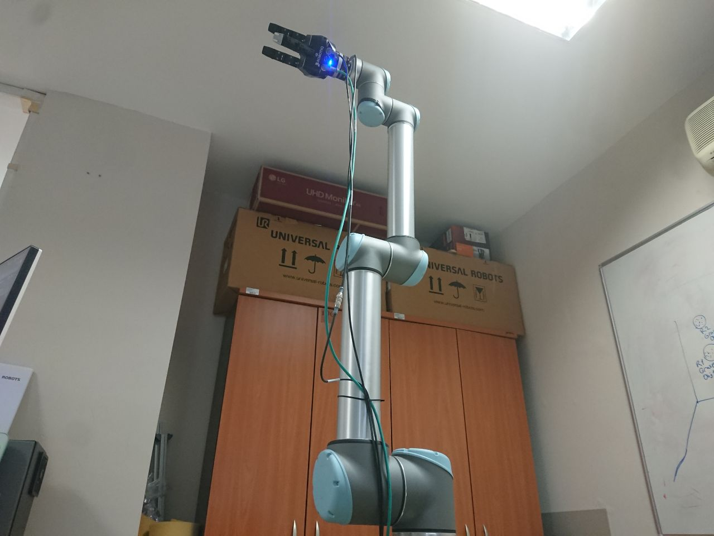
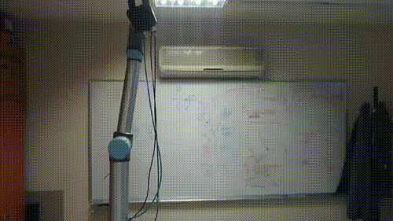

# UR10_robot_interface
**UR10 Robot interface for controlling it with ROS**
## Description 
This repo allows you to control easily the UR10 robot from your computer with ROS, sending commands to retrieve joint/cartesian position or to move the robot to desired positions.
*There are two versions of the interface*, one interface with [MoveIt](https://moveit.ros.org) motion planning framework (suggested because it has its own inverse kinematics solver to obtain cartesian position) and one interface sending directly the commands to the ROS topics, if you have problems with the MoveIt installation.

This works also with the [Gripper 3F interface](https://github.com/igor-lirussi/Gripper3F_interface)

| **Method**                  | **UR10 (Moveit)** | **UR10 (No Moveit)** |
|-----------------------------|-------------------|-----------------------|
| `get_joint_position`       | ✅                | ✅                    |
| `get_cartesian_position`   | ✅                | ✅                    |
| `set_joint_position`       | ✅                | ✅                    |
| `set_cartesian_position`   | ✅                | ❌                    |
| `table_pose`               | ✅                | ✅                    |
| `zero_pose`                | ✅                | ✅                    |
| `set_joint_velocity`       | ❌                | ✅                    |
| `get_joint_velocity`       | ❌                | ✅                    |
| `wobble`                   | ❌                | ✅                    |
| `get_force`                | ❌                | ✅                    |
| `get_torque`               | ❌                | ✅                    |

### Topics:
- Robotics
- UR10

## Result




## Requirements & Dependencies
- ROS 
- ros-noetic-moveit
- rospy and numpy
- https://github.com/ros-industrial/universal_robot build in your system with catkin
- https://github.com/UniversalRobots/Universal_Robots_ROS_Driver build in your system with catkin

(Please follow [this tutorial](https://jaspereb.github.io/UR5_With_ROS_Moveit_Tutorial/) for installation)


## Install 
*   install the Requirements & Dependencies
*   clone this repo in your project

## Run
*   remember to source the setup.bash of catkin
*   run the node to communicate with the robot
*   (if you use moveit) run the node to plan
*   use the interface as in the "Code" section
*   (optional)(if you use moveit) run the node to have the RViz GUI visualization

Example:
```bash
# on the UR10 robot pc
on -> start -> ok
program robot -> load program 
load the 'rosdriver.urp'
lower the speed!


# on the external pc

# FOR THE ROBOT
# source the knowledge for ROS
source /home/ur-colors/UR10_dockerized/catkin_ws/devel/setup.bash 
# activate env to have the pkgs installed
conda activate ur10_py3.9
# to activate the main node 
roslaunch ur_robot_driver ur10_bringup.launch robot_ip:=192.168.0.111 kinematics_config:=${HOME}/ur10colors_calibration.yaml
# ! you can press play on the robot screen, the progam finds the main node running, on the terminal you see 'Robot connected to reverse interface. Ready to receive control commands.'

# IF YOU WANT TO USE MOVE IT SERVICE PLANNER, in ANOTHER SHELL:
roslaunch ur10_moveit_config moveit_planning_execution.launch

# IF YOU WANT TO VISUALIZE THE ROBOT POSITION WITH MOVEIT and RVIZ, in ANOTHER SHELL:
roslaunch ur10_moveit_config moveit_rviz.launch

# (IF YOU HAVE A 3F GRIPPER) FOR THE GRIPPER, in ANOTHER SHELL:
# source the knowledge for ROS
source /home/ur-colors/UR10_dockerized/catkin_ws/devel/setup.bash 
# activate env to have the pkgs installed
conda activate ur10_py3.9
# launch the node for the gripper, it moves to calibrate
roslaunch robotiq_3f_driver listener.launch ip_address:=192.168.0.11
```


## Code
Example usage below:
```python
from ur10_interface_moveit import UR10
import rospy

rospy.init_node("ur10moving")
rospy.sleep(1.0)
robot = UR10()

cart=robot.get_cartesian_position()
print(cart)

pos=robot.get_joint_position()
print(pos)

robot.set_joint_position([-0.015, -1.7569, -1.3694, -1.4978, 1.7183, -2.4595])

robot.table_pose()
```

## Useful Resources & Extra
- https://jaspereb.github.io/UR5_With_ROS_Moveit_Tutorial/
- https://youtu.be/18SQssJ-l_Y
- https://github.com/UniversalRobots/Universal_Robots_ROS_Driver
- for ROS2: https://github.com/UniversalRobots/Universal_Robots_ROS2_Driver

## Authors
* **Igor Lirussi** @ BOUN Boğaziçi University - CoLoRs (Cognitive Learning and Robotics) Lab

## Acknowledgments
*   All the people that contributed with suggestions and tips.

## License
This project is licensed - see the [LICENSE](LICENSE) file for details.
